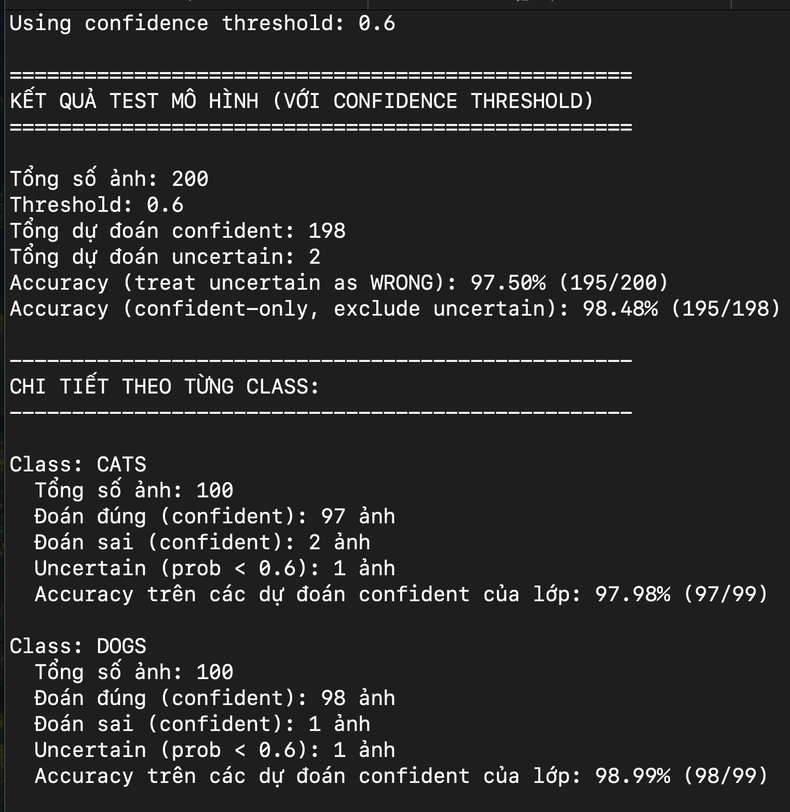

# Contact:
- **Mail**: *lytranvinh.work@gmail.com*
- **Github**: *https://github.com/Youknow2509*

# Cat vs Dog Classification Project

Dự án phân loại ảnh mèo và chó sử dụng Deep Learning với ResNet18.

## 📋 Mô tả

Đây là một dự án machine learning để phân loại hình ảnh giữa mèo và chó sử dụng mô hình ResNet18 được pre-trained trên ImageNet. Dự án bao gồm các chức năng:
- Huấn luyện mô hình
- Đánh giá hiệu suất
- Dự đoán trên ảnh mới
- Chuyển đổi model sang định dạng H5

## Kết quả dữ liệu test:


## 🗂️ Cấu trúc dự án

```
.
├── data/                          # Thư mục dữ liệu
│   ├── train/                     # Dữ liệu huấn luyện
│   │   ├── cats/                  # Ảnh mèo
│   │   └── dogs/                  # Ảnh chó
│   ├── valid/                     # Dữ liệu validation
│   │   ├── cats/
│   │   └── dogs/
│   ├── test/                      # Dữ liệu test
│   │   ├── cats/
│   │   └── dogs/
│   └── doc/                       # Tài liệu
├── train.py                       # Script huấn luyện model
├── evaluate.py                    # Script đánh giá model
├── predict.py                     # Script dự đoán
├── test_model_predict.py          # Script test dự đoán
├── create_pt_to_h5.py            # Chuyển đổi .pt sang .h5
├── catdog_resnet18_best.pt       # Model đã huấn luyện
├── requirements.txt               # Dependencies
└── README.md                      # File này
```

## 🚀 Cài đặt

### Yêu cầu hệ thống
- Python 3.8+
- CUDA (optional, để training trên GPU)

### Cài đặt dependencies

```bash
pip install -r requirements.txt
```

## 📊 Dữ liệu

Chuẩn bị dữ liệu theo cấu trúc:
- Training set: [`data/train/`](data/train/)
- Validation set: [`data/valid/`](data/valid/)
- Test set: [`data/test/`](data/test/)

Mỗi thư mục con chứa 2 folder: `cats/` và `dogs/`

## 🎯 Sử dụng

### 1. Huấn luyện model

```bash
python train.py
```

Hoặc sử dụng script:
```bash
bash run.sh
```

### 2. Đánh giá model

```bash
python evaluate.py
```

### 3. Dự đoán trên ảnh mới

```bash
python predict.py --image path/to/image.jpg
```

### 4. Test dự đoán

```bash
python test_model_predict.py
```

### 5. Chuyển đổi model sang H5

```bash
python create_pt_to_h5.py
```

## 🏗️ Kiến trúc mô hình

- **Backbone**: ResNet18 (pre-trained trên ImageNet)
- **Output layer**: Fully connected layer với 2 classes (cat, dog)
- **Loss function**: CrossEntropyLoss
- **Optimizer**: Adam/SGD

## 📈 Kết quả

Model đã được lưu tại: [`catdog_resnet18_best.pt`](catdog_resnet18_best.pt)

Để xem chi tiết về performance, chạy [`evaluate.py`](evaluate.py)

## 🔧 Cấu hình

Các tham số có thể điều chỉnh trong các file Python:
- Learning rate
- Batch size
- Number of epochs
- Image size
- Model architecture

## 📝 Scripts

- [`train.py`](train.py): Training loop và model checkpoint
- [`evaluate.py`](evaluate.py): Tính accuracy, precision, recall trên test set
- [`predict.py`](predict.py): Dự đoán single image
- [`test_model_predict.py`](test_model_predict.py): Test batch predictions
- [`create_pt_to_h5.py`](create_pt_to_h5.py): Convert PyTorch model to Keras H5 format

## 🐛 Troubleshooting

- Nếu gặp lỗi CUDA out of memory: giảm batch size
- Nếu accuracy thấp: tăng số epochs hoặc điều chỉnh learning rate
- Kiểm tra data augmentation trong training

## 📚 Tài liệu tham khảo

- [PyTorch Documentation](https://pytorch.org/docs/)
- [ResNet Paper](https://arxiv.org/abs/1512.03385)
- [Transfer Learning Guide](https://pytorch.org/tutorials/beginner/transfer_learning_tutorial.html)
