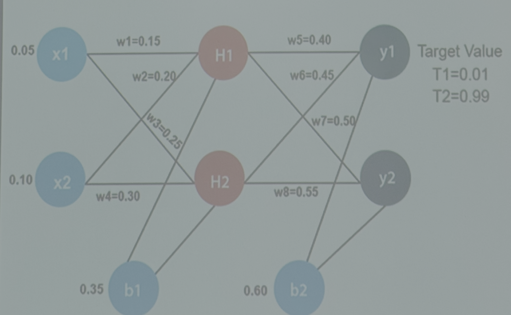

# ML cơ bản

## 1. Nơron

-   Dendnider (đuôi gai):: cảm nhận, tiếp nhận thông tin.
-   Soma:: tổng hợp thông tin từ các đuôi gai.
-   Nuclean: Xử lý thông tin, kích hoạt thông tin.
-   Sợi trục:: kết nối các nơron.

## 2. Active func ( hàm kích hoạt, hàm truyền)

### 2.1. Linear:

$$
f(x) = x \implies f'(x) = 1
$$

### 2.2. Sigmoid:

$$
o(x) = \frac{1}{1 + e^{-x}}
$$

$$
o'(x) = o(x) \cdot (1 - o(x))
$$

### 2.3. Tan - sigmoid

$$
f(x) = \frac{1 - e^{x}}{1 + e^{x}}
$$

$$
f'(x) = \frac{-2e^{x}}{(1 + e^{x})^2} =\frac{f(x)^{2} - 1}{2}
$$

### 2.4. Relu

$$
f(x) = \max(0, x)
$$

$$
f'(x) = \begin{cases}
0 & \text{nếu } x < 0 \\
1 & \text{nếu } x \geq 0
\end{cases}
$$

## 3. Ví dụ về hoạt động tranning của một mạng nơron đơn giản

### 3.1. Khởi tạo:
-   W1 = 0.15
-   W2 = 0.20
-   W3 = 0.25
-   W4 = 0.30
-   W5 = 0.40
-   W6 = 0.45
-   W7 = 0.50
-   W8 = 0.55
-   Cố định: B1 = 0.35; B2 = 0.60
-   Ta có:
$$
W =
    W - n *
    \frac{\partial L}{{\partial W}}
$$
$$
W =
    \begin{bmatrix}
        W1 \\
        W2 \\
        W3 \\
        W4 \\
        W5 \\
        W6 \\
        W7 \\
        W8
    \end{bmatrix};

    \frac{\partial L}{{\partial W}} =
    \begin{bmatrix}
        \frac{\partial L1}{{\partial W1}} \\
        \\
        \frac{\partial L2}{{\partial W2}} \\
        \\
        \frac{\partial L3}{{\partial W3}} \\
        \\
        \frac{\partial L4}{{\partial W4}} \\
        \\
        \frac{\partial L5}{{\partial W5}} \\
        \\
        \frac{\partial L6}{{\partial W6}} \\
        \\
        \frac{\partial L7}{{\partial W7}} \\
        \\
        \frac{\partial L8}{{\partial W8}}
    \end{bmatrix}
$$
-   Learning rate
    $$\eta$$
-   Loss function
    $$
     \frac{1}{2} ((y1-T1)^2 + (y2-T2)^2)
    $$
-   Tính toán:
    +
        $$
        H1
            = W1X1 + W2*X2 + B1
            = 0.15*0.05 + 0.20*0.10 + 0.35
            = 0.3775
        $$
        $$
        H1_Final =
            \sigma(H1) =
            \frac{1}{1 + e^{-H1}} =
            \frac{1}{1 + e^{-0.3775}} \approx
            0.5933
        $$
    +
        $$
        H2 =
        W3*X1 + W4*X2 + B1 =
        0.25*0.05 + 0.30*0.10 + 0.35 =
        0.3925
        $$
        $$
        H2_Final =
        \sigma(H2) =
        \frac{1}{1 + e^{-H2}} =
        \frac{1}{1 + e^{-0.3925}} \approx
        0.5968
        $$
    +
        $$
        Y1 =
            H1_Final * W5 + H2_Final * W6 + B2 = 1.1059
        $$
        $$
        Y1_Final =
        \sigma(Y1) =
        \frac{1}{1 + e^{-Y1}} =
        \frac{1}{1 + e^{1.1059}} \approx
        0.75136
        $$
    +
        $$
        Y2 =
        H1_Final * W7 + H2_Final * W8 + B2 =
        1.22489
        $$
        $$
        Y2_Final =
        \sigma(Y2) =
        \frac{1}{1 + e^{-Y2}} =
        \frac{1}{1 + e^{1.22489}} \approx
        0.7729
        $$
- Ta có `loss`:
$$
loss = 0.5 * [(y1 - T1)^2 + (y2 - T2)^2] = 0.5 * [(0.75136 - 0.01)^2 + (0.7729 - 0.99)^2] \approx 0.5 * [0.5504 + 0.0473] \approx 0.2984
$$
-   Backpropugation tính đạo hàm của hàm loss theo các trọng số
    $$
    L = 0.5*[(Y1_final - T1)^2 + (Y2_final - T2)^2 ]
    $$
    $$\eta= 0.1$$
-   Ta có
    $$
    W5 =
        W5 -
        n *
        \frac{\partial L}{\partial W5}
    $$
    $$
    W6 =
        W6 -
        n *
        \frac{\partial L}{\partial W6}
    $$
    $$
    W7 =
        W7 -
        n *
        \frac{\partial L}{\partial W7}
    $$
    $$
    W8 =
        W8 -
        n *
        \frac{\partial L}{\partial W8}
    $$
-   Ta tính:
    $$
    \frac{\partial L}{\partial W5} =
        \frac{\partial L}{\partial Y1_Final} *
        \frac{\partial Y1_Final}{\partial Y1} *
        \frac{\partial Y1}{\partial W5}
    $$
-   Tính từng phần:
$$
\frac{\partial L}{\partial Y1_Final} =
    (Y1_Final - T1)* Y1_Final =
    ...
$$
$$
\frac{\partial Y1_Final}{\partial Y1} =
    \frac{\partial \sigma(Y1)}{\partial Y1} =
    \sigma(Y1) * (1 - \sigma(Y1)) =
    Y1_Final * (1 - Y1_Final) =
    ...
$$
$$
\frac{\partial Y1}{\partial W5} =
    H1_Final
$$
$$
=> \frac{\partial L}{\partial W5} = ...
$$
$$
=> W5 = W5 - n * \frac{\partial L}{\partial W5} = ...
$$
=> Tương tự với W6, W7, W8
-   Tính W1: (Adv)
$$
W1 = W1 - n * \frac{\partial L}{\partial W1}
$$
-   Ta có:
$$
\frac{\partial L}{\partial W1} =
(
    \frac{\partial L}{\partial Y1_Final} *
    \frac{\partial Y1_Final}{\partial Y1} *
    \frac{\partial Y1}{\partial H1_Final} *
    \frac{\partial H1_Final}{\partial H1} *
    \frac{\partial H1}{\partial W1}
)
+
(
    \frac{\partial L}{\partial Y2*Final} *
    \frac{\partial Y2*Final}{\partial Y2} *
    \frac{\partial Y2}{\partial H1*Final} *
    \frac{\partial H1*Final}{\partial H1} *
    \frac{\partial H1}{\partial W1}
)
$$
-   Tính từng phần ta có:

$$
\frac{\partial L}{\partial Y1_Final} =
    (Y1_Final - T1) * Y1_Final = ...
$$

$$
\frac{\partial Y1_Final}{\partial Y1} =
    \frac{\partial \sigma(Y1)}{\partial Y1} = \sigma(Y1) * (1 - \sigma(Y1)) = ...
$$

$$
\frac{\partial Y1}{\partial H1_Final} =
    W5 = ...
$$

$$
\frac{\partial H1_Final}{\partial H1} =
    \frac{\partial \sigma(H1)}{\partial H1} = \sigma(H1) * (1 - \sigma(H1)) =
    H1_Final * (1 - H1_Final)
$$

$$
\frac{\partial H1}{\partial W1} =
    X1 = ...
$$

- Tương tự tính
$$
\begin{bmatrix}
\\
\frac{\partial L}{\partial Y2_Final} \\
\\
\frac{\partial Y2_Final}{\partial Y2} \\
\\
\frac{\partial Y2}{\partial H1_Final} \\
\\
\frac{\partial H1_Final}{\partial H1} \\
\\
\frac{\partial H1}{\partial W1}
\end{bmatrix}
$$
-   Rồi chả về kết quả `W1`
